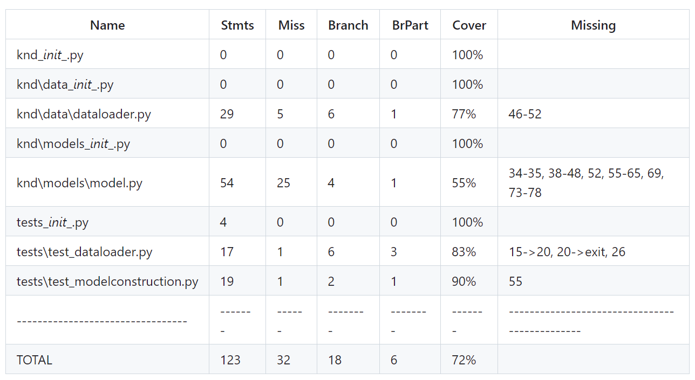
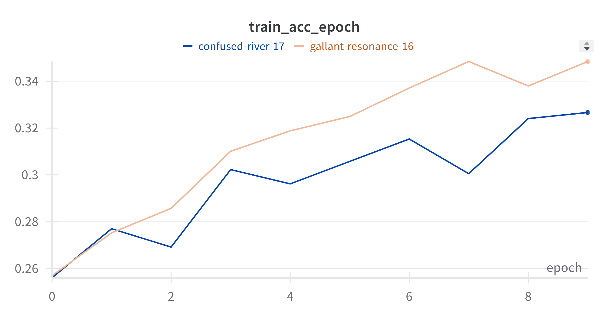
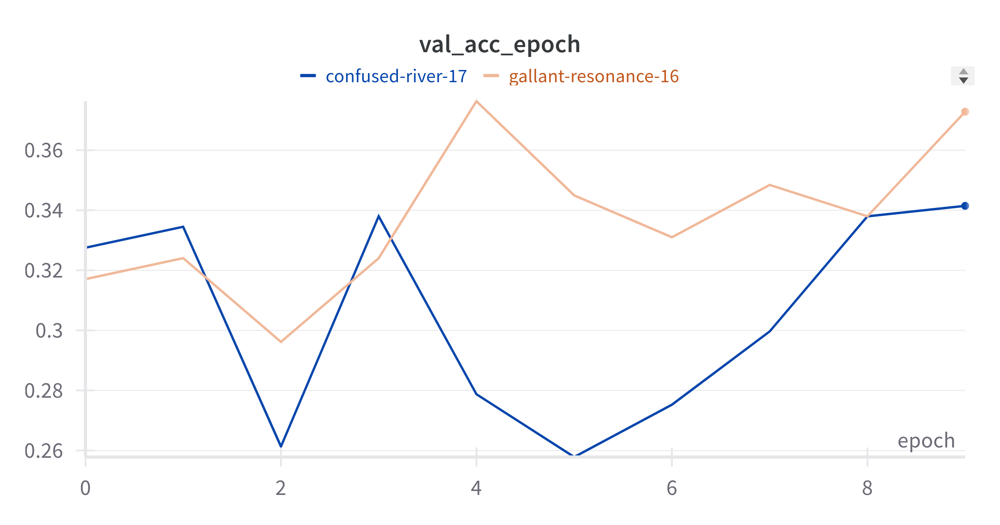
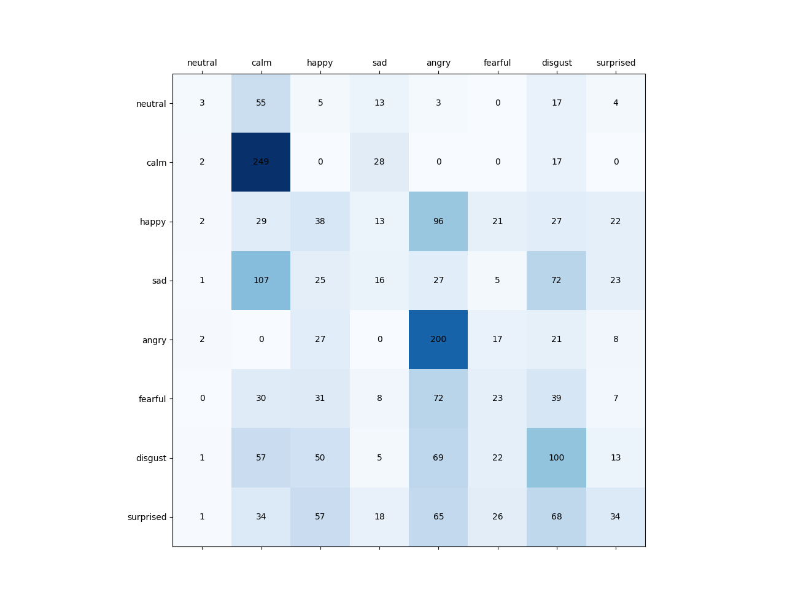
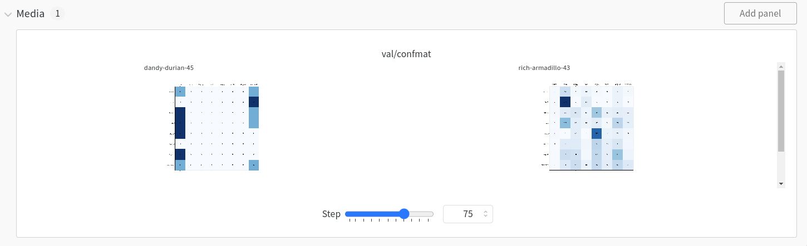
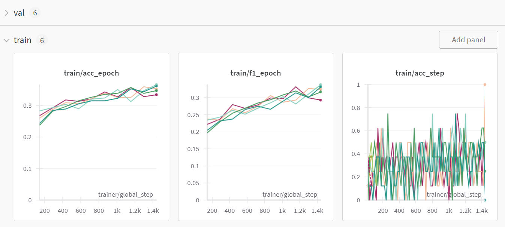
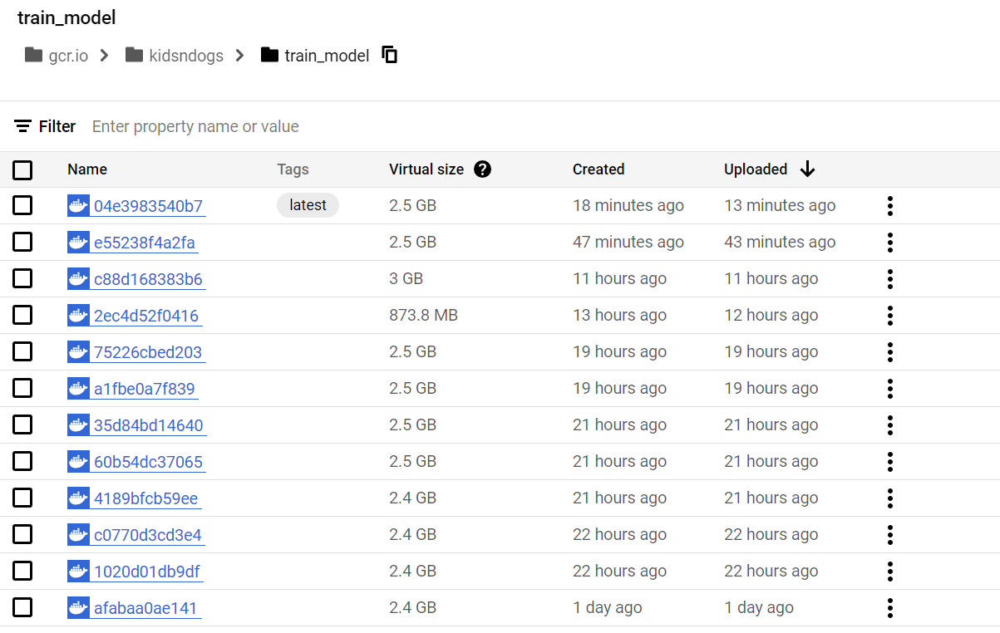
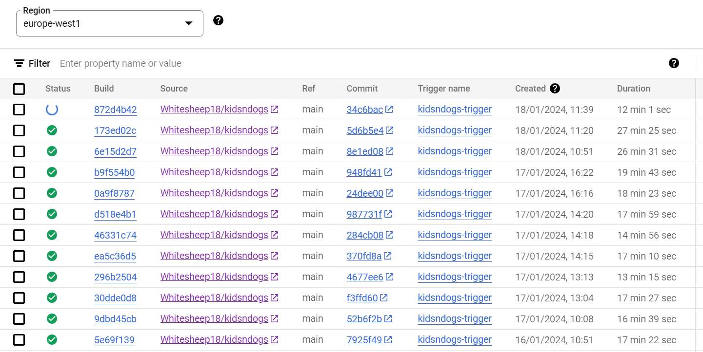
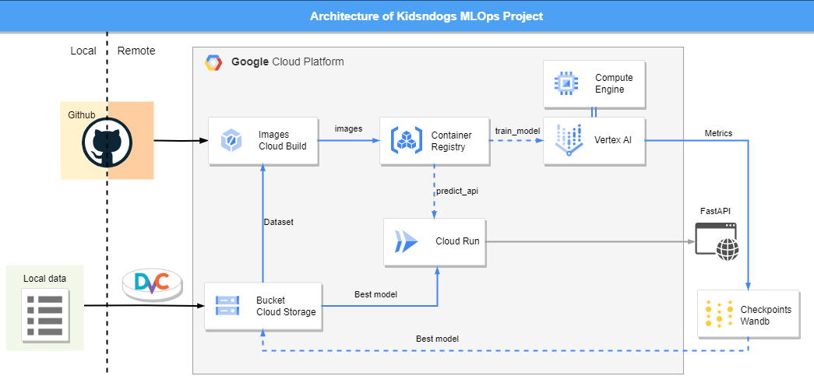

# Exam template for 02476 Machine Learning Operations

This is the report template for the exam. Please only remove the text formatted as with three dashes in front and behind
like:

```--- question 1 fill here ---```

where you instead should add your answers. Any other changes may have unwanted consequences when your report is auto
generated in the end of the course. For questions where you are asked to include images, start by adding the image to
the `figures` subfolder (please only use `.png`, `.jpg` or `.jpeg`) and then add the following code in your answer:

```markdown

```

In addition to this markdown file, we also provide the `report.py` script that provides two utility functions:

Running:

```bash
python report.py html
```

will generate an `.html` page of your report. After deadline for answering this template, we will autoscrape
everything in this `reports` folder and then use this utility to generate an `.html` page that will be your serve
as your final handin.

Running

```bash
python report.py check
```

will check your answers in this template against the constrains listed for each question e.g. is your answer too
short, too long, have you included an image when asked to.

For both functions to work it is important that you do not rename anything. The script have two dependencies that can
be installed with `pip install click markdown`.

## Overall project checklist

The checklist is *exhaustic* which means that it includes everything that you could possible do on the project in
relation the curricilum in this course. Therefore, we do not expect at all that you have checked of all boxes at the
end of the project.

### Week 1

* [x] Create a git repository
* [x] Make sure that all team members have write access to the github repository
* [x] Create a dedicated environment for you project to keep track of your packages
* [x] Create the initial file structure using cookiecutter
* [x] Fill out the `make_dataset.py` file such that it downloads whatever data you need and
* [x] Add a model file and a training script and get that running
* [x] Remember to fill out the `requirements.txt` file with whatever dependencies that you are using
* [x] Remember to comply with good coding practices (`pep8`) while doing the project
* [x] Do a bit of code typing and remember to document essential parts of your code
* [x] Setup version control for your data or part of your data
* [x] Construct one or multiple docker files for your code
* [x] Build the docker files locally and make sure they work as intended
* [x] Write one or multiple configurations files for your experiments
* [x] Used Hydra to load the configurations and manage your hyperparameters
* [x] When you have something that works somewhat, remember at some point to to some profiling and see if
      you can optimize your code
* [x] Use Weights & Biases to log training progress and other important metrics/artifacts in your code. Additionally,
      consider running a hyperparameter optimization sweep.
* [x] Use Pytorch-lightning (if applicable) to reduce the amount of boilerplate in your code

### Week 2

* [x] Write unit tests related to the data part of your code
* [x] Write unit tests related to model construction and or model training
* [x] Calculate the coverage.
* [x] Get some continuous integration running on the github repository
* [x] Create a data storage in GCP Bucket for you data and preferable link this with your data version control setup
* [x] Create a trigger workflow for automatically building your docker images
* [x] Get your model training in GCP using either the Engine or Vertex AI
* [x] Create a FastAPI application that can do inference using your model
* [ ] If applicable, consider deploying the model locally using torchserve
* [x] Deploy your model in GCP using either Functions or Run as the backend

### Week 3

* [x] Check how robust your model is towards data drifting
* [ ] Setup monitoring for the system telemetry of your deployed model
* [ ] Setup monitoring for the performance of your deployed model
* [ ] If applicable, play around with distributed data loading
* [ ] If applicable, play around with distributed model training
* [ ] Play around with quantization, compilation and pruning for you trained models to increase inference speed

### Additional

* [x] Revisit your initial project description. Did the project turn out as you wanted?
* [x] Make sure all group members have a understanding about all parts of the project
* [x] Uploaded all your code to github

## Group information

### Question 1
> **Enter the group number you signed up on <learn.inside.dtu.dk>**
>
> Answer:

Group 87

### Question 2
> **Enter the study number for each member in the group**
>
> Example:
>
> *sXXXXXX, sXXXXXX, sXXXXXX*
>
> Answer:

s164590, s220034, s232437, s220817

### Question 3
> **What framework did you choose to work with and did it help you complete the project?**
>
> Answer length: 100-200 words.
>
> Example:
> *We used the third-party framework ... in our project. We used functionality ... and functionality ... from the*
> *package to do ... and ... in our project*.
>
> Answer:

In the modeling phase, we employed torchaudio to effectively manage sound samples, while leveraging torchvision for modeling, specifically focusing on spectrograms. To reduce boilerplate we used Pytorch Lightning. Our model evaluation process was implemented with the incorporation of torchmetrics. Version control was handled through git and dvc, the latter dedicated to managing data, with our repository residing on GitHub. The project was containerized using Docker, and the final images was pushed to Container Registry. To keep tabs on our project's performance, we implemented logging through wandb and configured experiments using Hydra. Maintaining code integrity was a priority, achieved through the use of pytest for unit tests, and seamless integration of changes via GitHub Actions which came with the upload of profiling outputs.

## Coding environment

> In the following section we are interested in learning more about you local development environment.

### Question 4

> **Explain how you managed dependencies in your project? Explain the process a new team member would have to go**
> **through to get an exact copy of your environment.**
>
> Answer length: 100-200 words
>
> Example:
> *We used ... for managing our dependencies. The list of dependencies was auto-generated using ... . To get a*
> *complete copy of our development environment, one would have to run the following commands*
>
> Answer:

We used conda for managing our dependencies. We continuously built up the requirements.txt file, which we used to create a conda environment called knd. To get a complete copy of our development environment a new team member would have to 
1. Start a linux terminal with anaconda/miniconda installed
2. Clone this repository with git clone git@github.com:Whitesheep18/kidsndogs.git
3. run `make create_enviroment` to create a conda environment called knd
4. run `conda activate knd` to activate this environment
5. run `make requirements` to install all required packages (optionally one could execute `pip install requirements_dev.txt`)
6. run `dvc pull` to get the latest raw and processed data
We also ran pipreqs as a sanity check at the end of the project.
One can also build the image with `docker build -f dockerfiles/train_model.dockerfile . -t train_model:latest`

### Question 5

> **We expect that you initialized your project using the cookiecutter template. Explain the overall structure of your**
> **code. Did you fill out every folder or only a subset?**
>
> Answer length: 100-200 words
>
> Example:
> *From the cookiecutter template we have filled out the ... , ... and ... folder. We have removed the ... folder*
> *because we did not use any ... in our project. We have added an ... folder that contains ... for running our*
> *experiments.*
> Answer:

We initiated the project using the cookiecutter structure as a foundation. We filled different files such as 'make_dataset.py' file in the knd/data/ folder and the `model.py`, `predict_model.py` and `train_model.py` files in the knd/models folder have been completed, contributing to the overall project setup. Additional folders such as `.github`, `.dvc`, `configs` and `wandb` have been incorporated. `.github` handles unittesting and workflows, `.dvc` outlines the configuration for dvc and data push/pull operations, while `configs` manages the configuration files essential for project execution. We did not fill out the notebooks folder, which was removed since jupyter notebooks were not used for this project. We added a dockerfiles folder that includes the dockerfiles needed to build images for training and inference of the model. We did not use the knd/visualizations folder since wandb was used for visualizing results. 

### Question 6

> **Did you implement any rules for code quality and format? Additionally, explain with your own words why these**
> **concepts matters in larger projects.**
>
> Answer length: 50-100 words.
>
> Answer:

We have implemented branch protection rule to require a pull request before merging into main with at least one collaborator's approval of the changes. This reduces the likelihood of errors as well as encourages knowledge sharing (it forces minimum one group member other than the person who made the changes to look through the new code). It also helps with tracability as our CI/CD pipelines depend on the act of pushing to main (pull requests). Fx. if a cloud-build function fails, we know (from the timestamp) which pull request caused the error. 

## Version control

> In the following section we are interested in how version control was used in your project during development to
> corporate and increase the quality of your code.

### Question 7

> **How many tests did you implement and what are they testing in your code?**
>
> Answer length: 50-100 words.
>
> Example:
> *In total we have implemented X tests. Primarily we are testing ... and ... as these the most critical parts of our*
> *application but also ... .*
>
> Answer:

In total, three tests have been implemented in two separate scripts:
1. **`test_data_loading` in `test_dataloader.py`**:
   - This test checks the functionality of the data loaders. It ensures that both the training and testing dataloaders are correctly loading batches of data and that these batches match the expected number of samples.
2. **`test_model_initialization` in `TestDummyNetModel`**:
   - A unit test within the `TestDummyNetModel` class. It verifies the proper initialization of the `DummyNet` model with specified parameters such as learning rate, number of hidden units.
3. **`test_model_output_shape` in `TestDummyNetModel`**:
   - It checks if the `DummyNet` model produces output tensors of the correct shape.

### Question 8

> **What is the total code coverage (in percentage) of your code? If you code had an code coverage of 100% (or close**
> **to), would you still trust it to be error free? Explain you reasoning.**
>
> Answer length: 100-200 words.
>
> Example:
> *The total code coverage of code is X%, which includes all our source code. We are far from 100% coverage of our **
> *code and even if we were then...*
>
> Answer:

The total code coverage of our code is 72%. Although this is a good number, it's important to note areas where the coverage could be improved. Specifically, `knd\data\dataloader.py` and `knd\models\model.py` have lower coverage percentages, indicating potential untested logic paths.

Even if our code coverage reached 100%, it wouldn't guarantee the code is error-free. Code coverage metrics, while useful, only indicate that the code has been executed during tests, not that all use cases or edge cases have been adequately covered. For instance, our tests in `test_dataloader.py` and `test_modelconstruction.py` focus on specific aspects like the shape of the data and model initialization parameters, but they might not cover every possible input scenario, edge case, or integration point with other systems.

Complete coverage can give a false sense of security. It's crucial to complement high coverage with thorough test cases that cover a wide range of inputs, including edge cases, and to conduct other forms of testing such as integration testing, performance testing, and user acceptance testing to ensure the reliability and robustness of the code.



### Question 9

> **Did you workflow include using branches and pull requests? If yes, explain how. If not, explain how branches and**
> **pull request can help improve version control.**
>
> Answer length: 100-200 words.
>
> Example:
> *We made use of both branches and PRs in our project. In our group, each member had an branch that they worked on in*
> *addition to the main branch. To merge code we ...*
>
> Answer:
>
> 
Yes, our workflow extensively utilized branches and pull requests, aligning with best practices in version control and ensuring a collaborative and error-resistant development process. Specifically, we implemented branch protection on the main branch, meaning that direct pushes were prohibited, and updates were only allowed via pull requests. This approach ensured that each change was reviewed, and at least one other team member had to approve the pull request before merging. This facilitated peer review, leading to higher code quality and shared code ownership.

Moreover, we adopted a feature-branch workflow, creating separate branches for each addition or improvement, such as `docker`, `profiling`, `testing`, and `dvc`. This method allowed us to work on different features or fixes simultaneously without interfering with the main codebase or each other's work. Each branch focused on a specific task, making our development process more organized, manageable, and reducing the risk of conflicts. This branching strategy, coupled with pull requests and code reviews, greatly enhanced our version control, facilitateting continuous integration.


### Question 10

> **Did you use DVC for managing data in your project? If yes, then how did it improve your project to have version**
> **control of your data. If no, explain a case where it would be beneficial to have version control of your data.**
>
> Answer length: 100-200 words.
>
> Example:
> *We did make use of DVC in the following way: ... . In the end it helped us in ... for controlling ... part of our*
> *pipeline*
>
> Answer:

We used DVC in our project initially using Google Drive and later with a GCP bucket. Data version control makes it easier to collaborate on the same dataset and tracking changes. It is useful to know which changes/updates have been made to the data and being able to perform a rollback, if necessary. In our project, the dataset was static but updated once to include more data. In a bigger project running in the long-term, data versioning would be more beneficial. By incorporating DVC into our GitHub Actions workflow, we enhanced the reproducibility and consistency of our tests. The specific dataset version associated with each workflow run was automatically retrieved, guaranteeing that tests were conducted on the correct data.

### Question 11

> **Discuss you continues integration setup. What kind of CI are you running (unittesting, linting, etc.)? Do you test**
> **multiple operating systems, python version etc. Do you make use of caching? Feel free to insert a link to one of**
> **your github actions workflow.**
>
> Answer length: 200-300 words.
>
> Example:
> *We have organized our CI into 3 separate files: one for doing ..., one for running ... testing and one for running*
> *... . In particular for our ..., we used ... .An example of a triggered workflow can be seen here: <weblink>*
>
> Answer:

Our GitHub Actions workflow, **"Run Tests"** is integral to our Continuous Integration (CI) system, focusing on code robustness and compatibility. It activates for pushes or pull requests to main or master branches, reinforcing our commitment to high-quality code.

The workflow rigorously tests our code across various environments, trying different Python versions by supporting testing 3.10 and 3.11. Initialization involves setting up the required environment and installing dependencies listed in `requirements.txt`. A crucial enhancement to our CI process is the implementation of dependency caching, significantly optimizing build times:

```yaml
- name: Cache Python dependencies
  uses: actions/cache@v2
  with:
    path: ~/.cache/pip
    key: ${{ runner.os }}-pip-${{ hashFiles('**/requirements.txt') }}-${{ matrix.python-version }}
  restore-keys: |
    ${{ runner.os }}-pip-${{ matrix.python-version }}
```

This mechanism effectively reduces redundant downloads, utilizing cache keys generated based on the OS, Python version, and dependencies to ensure the cache's relevance and freshness.
Central to our workflow is performance profiling, to monitor and record the runtime characteristics of our code. By uploading these profiling results as workflow artifacts, we gain valuable insights into performance bottlenecks, allowing for targeted optimizations.

The workflow includes a specific section dedicated to data retrieval, crucial for tests that depend on datasets or specific data structures. This is accomplished using Data Version Control (DVC), an advanced version control system designed specifically for data science projects. The segment of the workflow:
```yaml
- name: Get data
  run: dvc pull
```
DVC works in conjunction with our existing Git-based workflow, ensuring that the data our tests rely on is the correct version, in sync with the code being tested. 

## Running code and tracking experiments

> In the following section we are interested in learning more about the experimental setup for running your code and
> especially the reproducibility of your experiments.

### Question 12

> **How did you configure experiments? Did you make use of config files? Explain with coding examples of how you would**
> **run a experiment.**
>
> Answer length: 50-100 words.
>
> Example:
> *We used a simple argparser, that worked in the following way: python my_script.py --lr 1e-3 --batch_size 25*
>
> Answer:

We used hydra to configure our experiments. The config files for experiments are found in configs/experiemnts. For example, by running 

`python knd/train_model.py`

one could run the default experiement, corresponding to exp1.yaml. By running 

`python knd/train_model.py experiment=<name-of-experiement>`

one would run another one of the experiemnt configurations placed in the experiments folder eg. experiment=exp2.

### Question 13

> **Reproducibility of experiments are important. Related to the last question, how did you secure that no information**
> **is lost when running experiments and that your experiments are reproducible?**
>
> Answer length: 100-200 words.
>
> Example:
> *We made use of config files. Whenever an experiment is run the following happens: ... . To reproduce an experiment*
> *one would have to do ...*
>
> Answer:

We applied configuration files as described earlier. When an experiment is executed, the hyperparameters specified in the Hydra config file are inserted into the model. The WandbLogger ensures that these hyperparameters are saved in Wandb, allowing us to review the hyperparameters associated with a model training run easily.
By checking Wandb, one can view the logged metrics alongside the parameters used, conveniently listed under `Config` in the run_name/Overview section. Additional information, such as who ran the model, when, and at what commit of our repository., is also available.
To replicate an experiment, one needs to identify the corresponding config file for a specific experiment and execute the following command:
`python knd/train_model.py experiment=<name-of-experiement>`
Alternatively, users can create a new config file with the necessary configuration settings.

### Question 14

> **Upload 1 to 3 screenshots that show the experiments that you have done in W&B (or another experiment tracking**
> **service of your choice). This may include loss graphs, logged images, hyperparameter sweeps etc. You can take**
> **inspiration from [this figure](figures/wandb.png). Explain what metrics you are tracking and why they are**
> **important.**
>
> Answer length: 200-300 words + 1 to 3 screenshots.
>
> Example:
> *As seen in the first image when have tracked ... and ... which both inform us about ... in our experiments.*
> *As seen in the second image we are also tracking ... and ...*
>
> Answer:

For both train and validation sets, we have logged metrics. We logged loss, accuracy, and macro F1 scores for the individual batches and after an epoch. Moreover, after each epoch, we also saved a confusion matrix. The run "gallant-resonance-16"  and  "confused-river-17" training and validation accuracy are illustrated in the following:


Accuracy is a good way of getting an idea of the model's overall performance.
Similarly, the macro F1 score also gives a good overview, but it is a measure that is adjusted for class-specific performance. We have decided to go with macro averaging, as our classes are balanced. The confusion matrix gives a more fine-grained insight into what classes the model is good (or bad) at predicting.


The runs use the same hyperparameters, but one is at an earlier epoch. Which gives us an understanding of the order in which the classes are learned. (One can also adjust the epoch number with the "step" slider to understand the individual run's behavior.) Furthermore, in, e.g., "rich-armadillo-43", the corresponding accuracy was relatively low. The F1 score was even lower, as the model tends to predict two classes ("calm" and "angry").
It's worth to note that later in the project we reorganized our metrics in wandb such that training and validation metrics are stored under different directories. For example instead of val_acc_epoch we stored val/acc_epoch. An example of this is presented in:

### Question 15

> **Docker is an important tool for creating containerized applications. Explain how you used docker in your**
> **experiments? Include how you would run your docker images and include a link to one of your docker files.**
>
> Answer length: 100-200 words.
>
> Example:
> *For our project we developed several images: one for training, inference and deployment. For example to run the*
> *training docker image: `docker run trainer:latest lr=1e-3 batch_size=64`. Link to docker file: <weblink>*
>
> Answer:

In our project, we have implemented a robust containerization and deployment strategy using Docker to encapsulate prediction models, prediction API, and model training processes. This strategy enables seamless execution both locally and on the Google Cloud platform, offering scalability. Our workflow includes automated builds triggered by GitHub updates, while manual building and registry push options offer flexibility. 

*Overview of Dockerfiles*

Our project employs Dockerfiles to define the configuration and dependencies for the following key components:

1. **Prediction Models:** The `prediction_model.dockerfile` encapsulates the environment necessary for deploying our prediction model.

2. **API Service:** The `predict_api.dockerfile` specifies the configuration for deploying our prediction API.

3. **Model Training:** The `train_model.dockerfile` provides the environment for the training model.

*For instance*
Developers can locally build Docker images using the following commands:
```docker build -f dockerfiles/train_model.dockerfile . -t <container_name>:latest```
and vice versa to the other two. Link to one of our docker files: <https://github.com/Whitesheep18/kidsndogs/blob/main/dockerfiles/predict_api.dockerfile>

*Cloud Deployment*

Automated builds and deployments on Google Cloud are facilitated by Cloud Build. Updates to the repository trigger the automatic creation of Docker images and subsequent deployment of updated containers on Google Cloud.

### Question 16

> **When running into bugs while trying to run your experiments, how did you perform debugging? Additionally, did you**
> **try to profile your code or do you think it is already perfect?**
>
> Answer length: 100-200 words.
>
> Example:
> *Debugging method was dependent on group member. Some just used ... and others used ... . We did a single profiling*
> *run of our main code at some point that showed ...*
>
> Answer:

For debugging during our experiments, we adopted a hybrid approach. Locally, we mostly utilized the built-in debugger in Visual Studio Code, which offers an intuitive environment for identifying and resolving issues with tools like "add checkpoint". In scenarios where the built-in debugger was not sufficient, we used traditional print statement debugging. This method, though simple, proved effective in tracing and understanding the flow of data and the state of variables at various execution points. We also looked at logs while moving the training process to the cloud from local.
In terms of code optimization and performance, we conducted profiling of our main code using PyTorch's built-in tools for the prediction of the emotion starting from the .wav audio file. The profiling data revealed that certain functions called while executing the prediction, notably load_model, were significant time consumers. Therefore, we implemented changes to optimize this function and avoid bottlenecks. The revised load_model function now incorporates a more efficient state loading strategy. In the updated implementation, we streamlined the process of loading the model's state dictionary from the checkpoint. By refining how we access and load the checkpoint data, we minimized I/O operations and reduced the overall loading time. 

## Working in the cloud

> In the following section we would like to know more about your experience when developing in the cloud.

### Question 17

> **List all the GCP services that you made use of in your project and shortly explain what each service does?**
>
> Answer length: 50-200 words.
>
> Example:
> *We used the following two services: Engine and Bucket. Engine is used for... and Bucket is used for...*
>
> Answer:

* Cloud Build: Building Docker images
* Cloud Storage: for storing and versioning data in a GCP bucket.
* Triggers: To automatically build images when changes are made to main. 
* Container Registry: Images are stored in containers.
* Compute Engine: To create and run virtual machines.
* Cloud Run: deploys the model in GCP. 
* Vertex AI: automatically create a VM for us, launch our experiments and then close the VM afterwards.

### Question 18

> **The backbone of GCP is the Compute engine. Explained how you made use of this service and what type of VMs**
> **you used?**
>
> Answer length: 100-200 words.
>
> Example:
> *We used the compute engine to run our ... . We used instances with the following hardware: ... and we started the*
> *using a custom container: ...*
>
> Answer:

In our project, we have utillized the computational power of Google Compute Engine to run three distinct containers dedicated to model training, predictions, and the prediction API. The instances deployed are of the following specifications:
```yaml
Machine Type: E2-highcpu-8
```
Moreover, we have leveraged Google Vertex AI for the streamlined training of our models. By incorporating a specific script into our project, as exemplified by the configuration file <https://github.com/Whitesheep18/kidsndogs/blob/main/config_VertexAI.yaml>, we have simplified the training process. This approach allows us to execute straightforward commands in Vertex AI, enhancing convenience and enabling multitasking for training of various models using a single command in the future. The Vertex AI instances utilized possess the following specifications:
```yaml
Machine Type: n1-highcpu-32
Machine Count: 1
Container Location: gcr.io/kidsndogs/train_model
config_VertexAI.yaml

workerPoolSpecs:
    machineSpec:
        machineType: n1-highcpu-32
    replicaCount: 1
    containerSpec:
        imageUri: gcr.io/kidsndogs/train_model
```
### Question 19

> **Insert 1-2 images of your GCP bucket, such that we can see what data you have stored in it.**
> **You can take inspiration from [this figure](figures/bucket.png).**
>
> Answer:


### Question 20

> **Upload one image of your GCP container registry, such that we can see the different images that you have stored.**
> **You can take inspiration from [this figure](figures/registry.png).**
>
> Answer:



### Question 21

> **Upload one image of your GCP cloud build history, so we can see the history of the images that have been build in**
> **your project. You can take inspiration from [this figure](figures/build.png).**
>
> Answer:



### Question 22

> **Did you manage to deploy your model, either in locally or cloud? If not, describe why. If yes, describe how and**
> **preferably how you invoke your deployed service?**
>
> Answer length: 100-200 words.
>
> Example:
> *For deployment we wrapped our model into application using ... . We first tried locally serving the model, which*
> *worked. Afterwards we deployed it in the cloud, using ... . To invoke the service an user would call*
> *`curl -X POST -F "file=@file.json"<weburl>`*
>
> Answer:

We have deployed our predict api in the cloud using Cloud Run. The image of the container predict_api is automatically created by a trigger in Cloud Build, then pulled into Cloud Run (manually). You can view the api through https://kidsndogs.dk/docs (which is a domain we bought) or https://predict-api-2tq5wj26ma-lz.a.run.app/docs (which is the assigned gcp domain) where you can try to upload a .wav file of the correct length (one is included in tests/) under POST "/predict". It may take some time to complete the first request, but the consequtive requests have lower latency. (This issue is described in an github issue). The root directory is just showing a health check.

### Question 23

> **Did you manage to implement monitoring of your deployed model? If yes, explain how it works. If not, explain how**
> **monitoring would help the longevity of your application.**
>
> Answer length: 100-200 words.
>
> Example:
> *We did not manage to implement monitoring. We would like to have monitoring implemented such that over time we could*
> *measure ... and ... that would inform us about this ... behaviour of our application.*
>
> Answer:

We have managed to implement monitoring of model drift using Evidently in the predict Api. A user can upload audio files, and statistics about these files (currently only the mean of the corresponding spectogram) get saved into an intermediate database (a .csv). The data about the submitted files get compared to the same statistics about our training set. This comparison can be invoked by using the GET method in monitoring. Evidently creates a monitoring.html file, which visualizes the comparisons. There are a number of problems with our current script though: firstly, instead of the mean, we should track meaningful features of our audio files (such as summary metrics of spectograms). Secondly, the evidently visualization cannot seem to handle a high enough precision to meaningfully visualize our metrics. An example monitoring.html is included in figures/. A successful monitoring pipeline would allow us to detect in time if the data we are supposed to train on changes over time, so we can change and retrain our model (such as sound samples recorded with a better quality device, in case our model has learnt to pick up on something device-related).

### Question 24

> **How many credits did you end up using during the project and what service was most expensive?**
>
> Answer length: 25-100 words.
>
> Example:
> *Group member 1 used ..., Group member 2 used ..., in total ... credits was spend during development. The service*
> *costing the most was ... due to ...*
>
> Answer:

In total (as of 19th January at 10 am), we spend US$18.33 on the project. We spend $12.13 on Cloud Storage, $3.66 on Cloud Run, $2.75 on Cloud Build, $2.28 on Compute Engine and $1.25 on Vertex AI. The reason for the relatively high cost for Google Storage was due to a bucket being created and used by Cloud Build to store container images generated by the Cloud Build services. Some images were a few GB in size. We mostly used the standard VMs which were also the cheapest, hence the total cost for the other services were not too high.


## Overall discussion of project

> In the following section we would like you to think about the general structure of your project.

### Question 25

> **Include a figure that describes the overall architecture of your system and what services that you make use of.**
> **You can take inspiration from [this figure](figures/overview.png). Additionally in your own words, explain the**
> **overall steps in figure.**
>
> Answer length: 200-400 words
>
> Example:
>
> *The starting point of the diagram is our local setup, where we integrated ... and ... and ... into our code.*
> *Whenever we commit code and puch to github, it auto triggers ... and ... . From there the diagram shows ...*
>
> Answer:

In the diagram we have separated the local from the remote setup. On the left side of the black dashed line, the local setup includes the local data storage and github repository. On the right side of the line, we have the setup up in the cloud which includes all the services used in GCP as well as the Fast API application that creates an interface between the ML model and the end user. Whenever changes are made to files in the repository and pushed to the main branch, continuous integration is ensured by a trigger in GCP that rebuilds images for training and prediction. Once the training image is built, it is used to create a training job in Vertex AI and simultaneously logged in Weights and Biases. The prediction API is containerized using another Docker container which is deployed in Cloud Run. Through the deployment, an API can viewed in the browser using FastAPI. In this way, end users can interact with the model and perform prediction, which in our case includes uploading an audio file as input and getting the predicted emotion as output. Additionally, DVC is used for data versioning and a GCP bucket is used for storing data in the cloud. The dockerfiles in the repo pulls the data from the cloud to make it available for training.


### Question 26

> **Discuss the overall struggles of the project. Where did you spend most time and what did you do to overcome these**
> **challenges?**
>
> Answer length: 200-400 words.
>
> Example:
> *The biggest challenges in the project was using ... tool to do ... . The reason for this was ...*
>
> Answer:

Some of the biggest challenges in the project included making the different tools work together. For example, getting model training to work in Vertex AI proved to be a challenge. We managed to perform training locally but moving it to the cloud required building an image in Cloud build, fetch it from Container Registry, getting data from Cloud Storage and perform training in Vertex AI. We especially struggled with pulling the data from the cloud into our docker container. Authentications, such as dvc and wandb authentication, was challenging at several occasions and took a significant amount of debugging. It took a long time to build images, hence debugging was a cumbersome process. Implementing multiple frameworks and trying to make them work together also caused some troubles. For example, having Hydra together with Weights and Biases. We eventually found some workarounds, however, we learned that choosing a selection of tools and exploiting their features might be advantageous as making multiple tools work together can be unnecessarily complicated. Lastly, we had some minor challenges while collaborating in GitHub since some group members were new to the workflow. This led to merge conflicts and many branches in the repository but this improved as we got used to the github workflow.

### Question 27

> **State the individual contributions of each team member. This is required information from DTU, because we need to**
> **make sure all members contributed actively to the project**
>
> Answer length: 50-200 words.
>
> Example:
> *Student sXXXXXX was in charge of developing of setting up the initial cookie cutter project and developing of the*
> *docker containers for training our applications.*
> *Student sXXXXXX was in charge of training our models in the cloud and deploying them afterwards.*
> *All members contributed to code by...*
>
> Answer:

Overall, we cooperated on most of the tasks in this project.
S164590: in charge of processing data and setting up CI in GCP.
s220817: was responsible for metrics logging and deploying the API.
s232437: was in charge of implementing testing, profiling and CI in GitHub.
s220034: made docker containers and training in the cloud.


